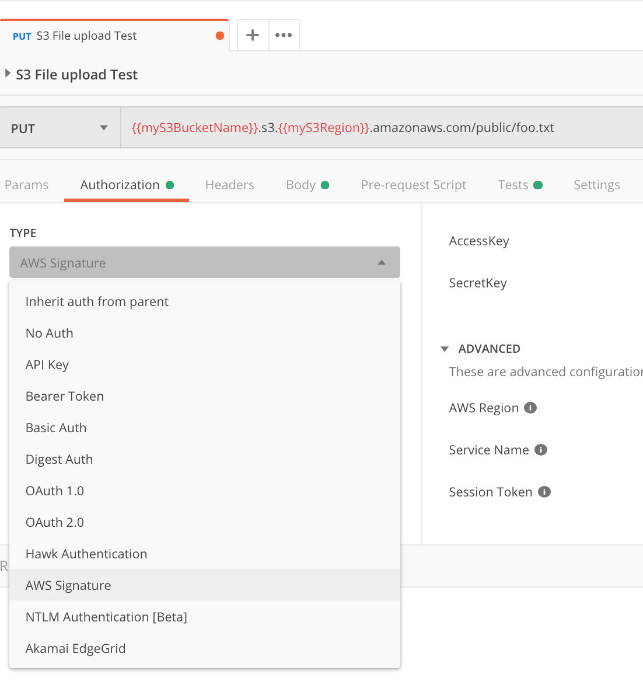
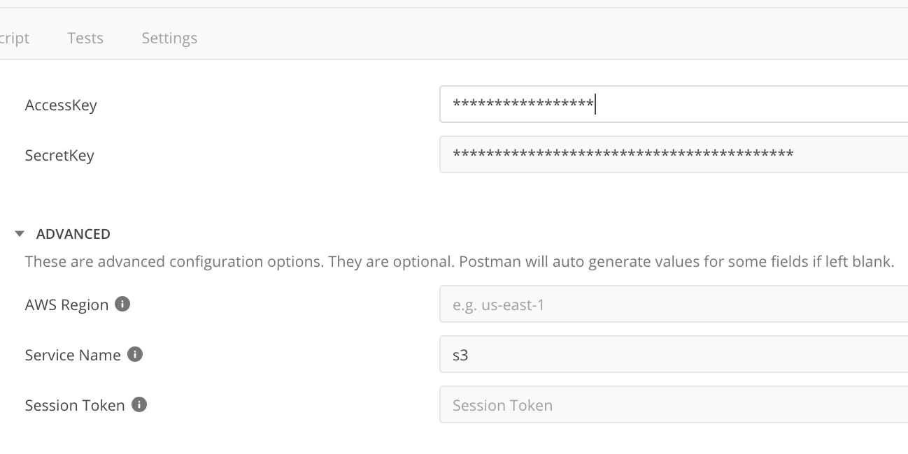
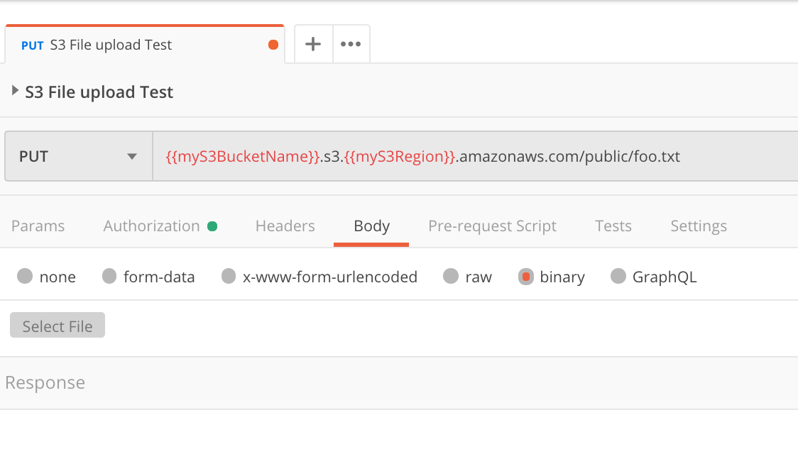
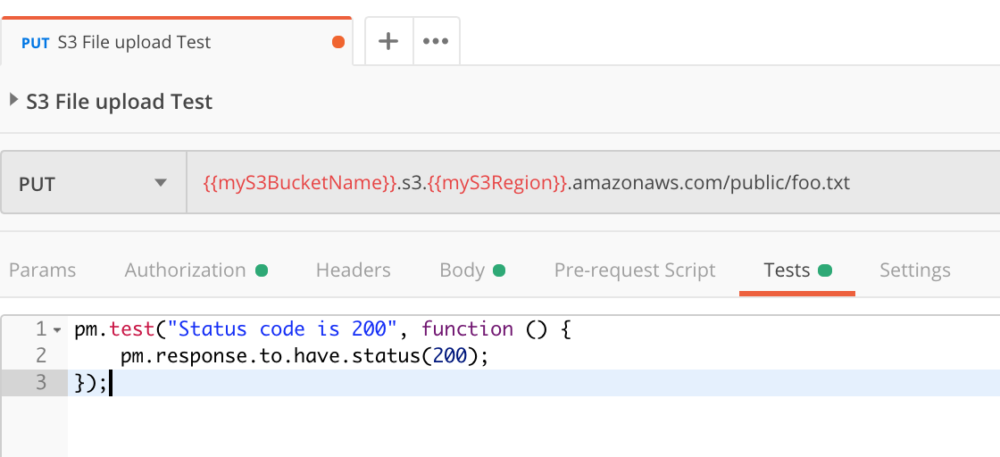

Testing file uploads to AWS S3 with IAM user credentials in Postman

This tutorial describes how you can use [Postman](https://www.postman.com/downloads/) to test file uploads to your AWS S3 bucket with IAM User credentials and write as short status test script. I am going to show you how to upload a file to a S3 bucket and how to test that the IAM user credentials for that bucket are working correctly. This tutorial assumes you have already setup an S3 Bucket and an IAM user with Access Key, Secrete Key and access rights to your S3 bucket.

--- 

First of all, I find the AWS docs quite confusing and not easy to read. Diving into the docs we found the link to [PutObject](https://docs.aws.amazon.com/AmazonS3/latest/API/API_PutObject.html) Example 1: Upload an object shows you what the call expects. Furthermore, Postman has this great feature that allows you to sign your AWS request under the hood, so that you do not have to [calculate](https://docs.aws.amazon.com/AmazonS3/latest/API/sigv4-query-string-auth.html) any signatures yourself.

```bash
PUT /my-image.jpg HTTP/1.1
Host: myBucket.s3.<Region>.amazonaws.com
Date: Wed, 12 Oct 2009 17:50:00 GMT
Authorization: authorization string
Content-Type: text/plain
Content-Length: 11434
x-amz-meta-author: Janet
Expect: 100-continue
[11434 bytes of object data]
```

So let’s get started in the Postman App:

In order to set up our request and auth in Postman, I first open up a new request tab for my PUT request and define the request URL as per the example in the AWS docs.

You have two options to store your bucket name and region. You can either store your S3 Bucket name and region as [global variables](https://www.youtube.com/watch?v=TU1i1CgjVR8) and call those variables in your request. This is what I did here. However, you can also just replace {{myS3BucketName}} with your bucket name directly.

```bash
<name-of-my-S3-Bucket>.s3.<the-region-my-bucket-is-set-to>.amazonaws.com/<path-inside-S3/name-of-file-to-upload>
```


I then go to the Authorization tab and select ‘Type’ and then ‘AWS Signature’. Here are the [Postman docs on AWS Signature](https://learning.postman.com/docs/postman/sending-api-requests/authorization/#aws-signature) setting.


I then log into my AWS console, navigate to IAM and find the user that I want to connect to my S3 Bucket. I get the IAM User AccessKey and SecretKey and provide the values to Postman. I also set the service name to s3.


Postman also accepts file uploads. You can do so in the request ‘Body’ by selecting ‘binary’ and then uploading a file from your computer.


Next, I also include a Test Script for status updates in the Postman console. This will tell me if my file upload to S3 was successful with a status 200.


Hitting ‘send’ will post the file to your S3 bucket and a 200 response should come back.

You can then navigate to your S3 bucket and check that your test file was uploaded successfully. This is what the Postman console looks like.


Congratulations! You now have successfully tested file uploads to your S3 bucket. You can navigate to your S3 bucket in AWS and check that your test file was uploaded successfully.

---

This completes the test of file upload to your S3 Bucket using your IAM user credentials with Postman. The process of uploading a test file via Postman has proven that that your IAM user has the right access rights for your S3 bucket.
I hope this tutorial provides you with an easy way to test your credentials and settings and helps you with developing or debugging file upload to AWS S3.